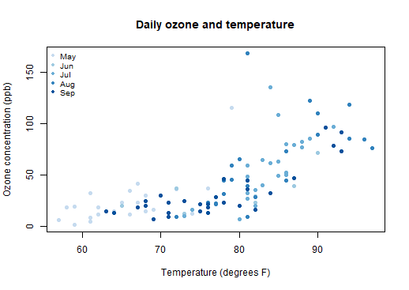

Urban Air Quality Explorer
========================================================
author: "Author: Sonja Sahebzad"
date: September 17, 2026
css: pitch.css
width: 1440
height: 900

<div class="subtitle">An interactive Shiny application for exploring weather and ozone</div>

<div class="title-note">Johns Hopkins University / Coursera<br>Developing Data Products Course Project</div>

Why this application?
========================================================

Air quality changes from day to day, while static summaries can hide important patterns.

<div class="three-cards">
  <div class="pitch-card"><b>Explore</b><br>Filter by month, temperature, and wind.</div>
  <div class="pitch-card"><b>Understand</b><br>Inspect daily observations in an interactive Plotly chart.</div>
  <div class="pitch-card"><b>Estimate</b><br>Create a weather scenario and view a model-based ozone prediction.</div>
</div>

The app turns the built-in R <code>airquality</code> data into a guided, interactive experience.

How the user interacts
========================================================

### Explore tab

* Select one or more summer months
* Adjust temperature and wind ranges
* Choose what marker size represents
* Hover, zoom, and reset the chart

### Predict tab

* Set temperature, wind, and month
* Receive an immediate ozone estimate
* Read the 95% prediction interval
* Compare candidate models and their validation error

***



<div class="chart-note">The live Shiny version adds filters, hover details, zoom, summaries, and model-based predictions.</div>

Reproducible model comparison
========================================================

The app compares an additive model with a plausible temperature by wind interaction. Five-fold cross-validation evaluates prediction error.


``` r
aq <- na.omit(airquality)
aq$MonthName <- factor(month.abb[aq$Month])

set.seed(2026)
fold <- sample(rep(1:5, length.out = nrow(aq)))
cv_rmse <- function(formula) {
  predicted <- rep(NA_real_, nrow(aq))
  for (i in 1:5) {
    model <- lm(formula, data = aq[fold != i, ])
    predicted[fold == i] <- predict(model, aq[fold == i, ])
  }
  sqrt(mean((aq$Ozone - predicted)^2))
}

round(c(
  additive = cv_rmse(Ozone ~ Temp + Wind + MonthName),
  interaction = cv_rmse(Ozone ~ Temp * Wind + MonthName)
), 2)
```

```
   additive interaction 
      22.35       21.49 
```

The deployed application repeats the comparison with fixed, reproducible cross-validation folds and uses the lower-error model.

Why it is a useful data product
========================================================

<div class="closing-grid">
  <div><b>Reactive</b><br>Charts, summaries, tables, and predictions update when the user changes an input.</div>
  <div><b>Documented</b><br>The app explains how to use each feature and states its limits.</div>
  <div><b>Reproducible</b><br>The repository contains the full Shiny code and this five-slide RStudio Presenter source.</div>
</div>

### Responsible interpretation

The patterns are descriptive associations from New York in one summer in 1973. The predictions are educational and are not current health guidance.

<div class="final-note">Created on September 17, 2026 by Sonja Sahebzad</div>
